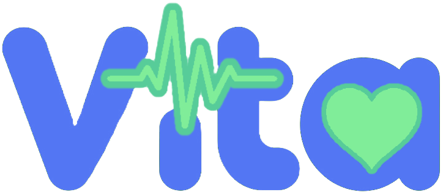

# Tu Salud en tus Manos

## Gestiona y Comparte Tu Historial Médico de Forma Segura

### ¿Qué es Vita?

Vita es una innovadora plataforma que empodera a los pacientes al ofrecer un espacio **seguro y centralizado** para gestionar y compartir sus registros médicos. Con nuestra aplicación, tu salud está siempre al alcance de tu mano.

### Características Clave:

- **Almacenamiento Seguro**: Todos tus documentos médicos se guardan en tu **Google Drive**, asegurando privacidad y acceso fácil.
  
- **Compartición Rápida**: Comparte tus registros con médicos y especialistas con solo un clic, mejorando la comunicación y la atención.

- **Inteligencia Artificial On-Premise**: Nuestra herramienta de IA interpreta tus documentos y proporciona retroalimentación personalizada para que tomes decisiones informadas sobre tu salud. Esto sucede en tu mismo dispositivo y no se comunica con ningún servicio de cloud, así resguardando la propiedad de tus datos.

- **Acceso 24/7**: Accede a tu historial médico en cualquier momento y desde cualquier lugar, facilitando el seguimiento de tu salud.

### Beneficios:

- **Ahorra Tiempo y Dinero**: Evita exámenes duplicados y reduce la carga administrativa.
  
- **Toma de Decisiones Informadas**: Con toda tu información en un solo lugar, tus médicos pueden ofrecerte un tratamiento más efectivo.

- **Control Total**: Tú decides quién accede a tu información médica.

¡Descubre cómo Vita puede transformar tu experiencia de atención médica y pon **tu salud en tus manos** hoy mismo!
